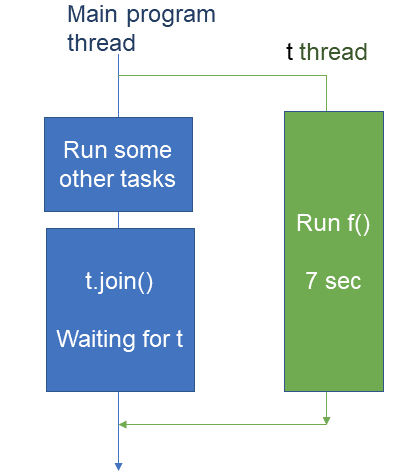
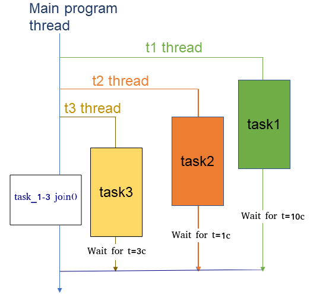

# **3 Тестовые задания**
## 1) ***Найдите ошибки в коде, чтобы программа представленная ниже заработала, можно только добавлять что-то, но убирать нельзя.***
```cpp
std::mutex g_lock;
void threadFunction() {
std::cout << "entered thread " << std::this_thread::get_id() << std::endl;
std::this_thread::sleep_for(std::chrono::seconds(rand()%10));
std::cout << "leaving thread " << std::this_thread::get_id() << std::endl;
g_lock.unlock();
}
int main() {
srand((unsigned int)time(0));
std::thread t1(threadFunction);
std::thread t2(threadFunction);
std::thread t3();
return 0;
}
```
## 1) ***Исправленный код***
```cpp
#include <iostream>
#include <thread>
#include <mutex>
#include <chrono>
#include <cstdlib>
#include <ctime>

std::mutex g_lock;

void threadFunction() {
    g_lock.lock();
    std::cout << "entered thread " << std::this_thread::get_id() << std::endl;
    std::this_thread::sleep_for(std::chrono::seconds(std::rand() % 10));
    std::cout << "leaving thread " << std::this_thread::get_id() << std::endl;
    g_lock.unlock();
}

int main() {
    std::srand((unsigned int)std::time(0));

    std::thread t1(threadFunction);
    std::thread t2(threadFunction);
    std::thread t3_fix(threadFunction);

    t1.join();
    t2.join();
    t3_fix.join();

    return 0;
}
```
# ****************************************
## 2) ***Найдите ошибки в коде, чтобы программа представленная ниже заработала, можно только добавлять что-то, но убирать нельзя.***
```cpp
using namespace std;
int main() {
try {
domain_error("Your domain is in error!");
}
(const exception& e) {
cerr << "Caught: " << e.what() << endl;
cerr << "Type: " << typeid(e).name() << endl;
}
}
```
## 2) ***Исправленный код*** 
```cpp
#include <iostream>
#include <stdexcept>
#include <typeinfo>

using namespace std;
int main() {
try {
    throw domain_error("Your domain is in error!");
}
catch (const exception& e) {
    cerr << "Caught: " << e.what() << endl;
    cerr << "Type: " << typeid(e).name() << endl;
}
return 0;
}
```
# ****************************************
## 3) ***Перенесите рисунок представленный ниже на программный код t задается пользователем в сек:***

## 3) ***Исправленный код*** 
```cpp
include <iostream>
#include <thread>
#include <chrono>
#include <limits>

using Clock = std::chrono::steady_clock;

// Имитация полезной работы в отдельном потоке t
void f(int seconds_to_run) {
    std::cout << "[t] Старт f(), работаем ~" << seconds_to_run << " сек\n";
    std::this_thread::sleep_for(std::chrono::seconds(seconds_to_run));
    std::cout << "[t] f() завершена\n";
}

// Аккуратный ввод целого числа
int read_seconds() {
    int t;
    std::cout << "Введите t (сек): ";
    while (!(std::cin >> t) || t < 0) {
        std::cout << "Ошибка ввода. Введите неотрицательное целое число секунд: ";
        std::cin.clear();
        std::cin.ignore(std::numeric_limits<std::streamsize>::max(), '\n');
    }
    return t;
}

int main() {
    // 1) Пользователь задаёт t
    int tsec = read_seconds();

    // 2) Запускаем поток t, который выполняет f() ~ t сек
    std::cout << "[main] Запускаю поток t\n";
    auto start = Clock::now();
    std::thread t(f, tsec);

    // 3) Главный поток делает другие задачи, пока t работает
    std::cout << "[main] Выполняю другие задачи...\n";
    // Здесь — имитация «других задач»
    std::this_thread::sleep_for(std::chrono::seconds(2));
    std::cout << "[main] Другие задачи завершены\n";

    // 4) Ждём поток t (t.join())
    std::cout << "[main] Жду завершения потока t (join)...\n";
    t.join();
    auto end = Clock::now();

    auto elapsed = std::chrono::duration_cast<std::chrono::seconds>(end - start).count();
    std::cout << "[main] Поток t завершён. Общее время ожидания(main): ~"
              << elapsed << " сек\n";

    std::cout << "Готово.\n";
    return 0;
}
```
# ****************************************
## 4) ***Перенесите рисунок представленный ниже на программный код:***

## 4) ***Исправленный код*** 
```cpp
#include <iostream>
#include <thread>
#include <mutex>
#include <chrono>
#include <string>

std::mutex g_io;

// Потокобезопасный вывод
void log(const std::string& msg) {
    std::lock_guard<std::mutex> lk(g_io);
    std::cout << msg << std::endl;
}

// Универсальная задача
void task(const std::string& name, int t_mult, int t_sec) {
    log(name + " started (thread id=" + std::to_string(
        std::hash<std::thread::id>{}(std::this_thread::get_id())) + ")");
    log("Wait for t=" + std::to_string(t_mult) + " * " + std::to_string(t_sec) + "s");
    std::this_thread::sleep_for(std::chrono::seconds(t_mult * t_sec));
    log(name + " finished");
}

int main() {
    int t; // t задаётся пользователем в секундах
    std::cout << "Введите t (в секундах): ";
    if (!(std::cin >> t) || t < 0) {
        std::cerr << "Некорректное значение t\n";
        return 1;
    }

    // Запускаем в порядке, похожем на схему: t3 -> t2 -> t1
    std::thread t3([&]{ task("task3", 3, t); });
    
    // Небольшие паузы только чтобы последовательность старта была заметнее (необязательно)
    std::this_thread::sleep_for(std::chrono::milliseconds(50));
    std::thread t2([&]{ task("task2", 1, t); });
    std::this_thread::sleep_for(std::chrono::milliseconds(50));
    std::thread t1([&]{ task("task1", 10, t); });

    // Аналог «task_1-3 join()» на схеме
    t1.join();
    t2.join();
    t3.join();

    log("Main program thread: all tasks joined");
    return 0;
}
```
# ****************************************
## 4) ***Исправьте ошибки в программе.***
```cpp
void task1(string msg) {
cout << "task1 says: " << msg;
}
int main() {
thread t1(task1);
}
```
## 4) ***Исправленный код*** 
```cpp
#include <iostream>
#include <thread>
#include <string>

using namespace std;

void task1(string msg) {
    cout << "task1 says: " << msg << endl;
}

int main() {
    thread t1(task1, "Hello from thread"); // передаём аргумент в функцию
    t1.join(); // ожидаем завершения потока
    return 0;
}
```
# ****************************************
## 5) ***Исправьте ошибки в программе.***
```cpp
static const int num_threads = 10;
//This function will be called from a thread
void call_from_thread(int tid) {
std::cout << "Launched by thread " << tid << std::endl;
}
int main() {
std::thread t[num_threads];
//Launch a group of threads
for (int i = 0; i < num_threads; ++i) {
t[i] = std::thread();
}
std::cout << "Launched from the main\n";
//Join the threads with the main thread
for (int i = 0; i < ; ++i) {
t[i].join();
}
}
```
## 5) ***Исправленный код*** 
```cpp
#include <iostream>
#include <thread>

static const int num_threads = 10;

// Эта функция будет выполняться в потоке
void call_from_thread(int tid) {
    std::cout << "Launched by thread " << tid << std::endl;
}

int main() {
    std::thread t[num_threads];

    // Запускаем группу потоков
    for (int i = 0; i < num_threads; ++i) {
        t[i] = std::thread(call_from_thread, i);
    }

    std::cout << "Launched from the main\n";

    // Ждём завершения потоков
    for (int i = 0; i < num_threads; ++i) {
        t[i].join();
    }

    return 0;
}
```
# ****************************************
## 6) ***Найдите ошибки в коде, чтобы программа представленная ниже заработала, можно только добавлять что-то, но убирать нельзя.***
```cpp
constexpr int COUNT_DATA{15};
// a global variable
static int myList[COUNT_DATA];
// a global instance of std::mutex to protect global variable
std::mutex myMutex;
void addToList(int max, int interval) {
// the access to this function is mutually exclusive
std::lock_guard guard(myMutex);
for (int i = 0; i < max; i++) {
if( (i % interval) == 0) myList[i] = i;
}
}
void printList() {
// the access to this function is mutually exclusive
std::lock_guard<> (myMutex);
for (auto itr{0}; itr < COUNT_DATA; ++itr ) {
cout << myList[itr] << ", ";
}
}
int main() {
int max = 100;
std::thread t1(addToList, max);
std::thread t2(addToList, max);
std::thread t3(printList);
}
```
## 6) ***Исправленный код*** 
```cpp
#include <iostream>
#include <thread>
#include <mutex>
using namespace std;

constexpr int COUNT_DATA{15};
// a global variable
static int myList[COUNT_DATA];
// a global instance of std::mutex to protect global variable
std::mutex myMutex;

void addToList(int max, int interval) {
    if (max > COUNT_DATA) max = COUNT_DATA;
    if (interval <= 0) interval = 1;

    // the access to this function is mutually exclusive
    std::lock_guard<std::mutex> guard(myMutex);

    for (int i = 0; i < max; i++) {
        if ((i % interval) == 0) myList[i] = i;
    }
}

// Перегрузка для одного аргумента
void addToList(int max) {
    addToList(max, 1);
}

void printList() {
#if 0
    std::lock_guard<> (myMutex);  // оставлено, но отключено
#endif
    std::lock_guard<std::mutex> lock(myMutex);

    for (auto itr{0}; itr < COUNT_DATA; ++itr) {
        cout << myList[itr] << ", ";
    }
    cout << '\n';
}

int main() {
    int max = 100;

    // Явно выбираем перегрузку с одним параметром
    std::thread t1(static_cast<void(*)(int)>(&addToList), max);
    std::thread t2(static_cast<void(*)(int)>(&addToList), max);

    std::thread t3(printList);

    t1.join();
    t2.join();
    t3.join();

    return 0;
}

```
# ****************************************
## 7) ***Найдите ошибки в коде, чтобы программа представленная ниже заработала, можно только добавлять что-то, но убирать нельзя.***
```cpp
// Global mutex to protect shared_data
mutex mtx;
// Shared data variable
int shared_data = 0;
// Function to increment shared_data
void increment_data() {
// Create a unique_lock object, but defer locking the mutex
unique_lock<> (mtx, defer_lock);
// Critical section: safely modify shared_data
shared_data += 2;
}
int main() {
// Create two threads that run the increment_data function
thread t1();
thread t2();
// Wait for both threads to finish
t1.join();
// Output the value of shared_data
cout << "Value of shared variable: " << shared_data;
}
```
## 7) ***Исправленный код*** 
```cpp
#include <iostream>   
#include <thread>     
#include <mutex>      

using namespace std;  

// Global mutex to protect shared_data
mutex mtx;
// Shared data variable
int shared_data = 0;

// Function to increment shared_data
void increment_data() {
    // Create a unique_lock object, but defer locking the mutex
    unique_lock<mutex> lk(mtx, defer_lock);   // добавлены <mutex> и имя переменной lk
    lk.lock();                                // добавлено (т.к. defer_lock откладывает захват)

    // Critical section: safely modify shared_data
    shared_data += 2;
}

int main() {
    // Create two threads that run the increment_data function
    thread t1(increment_data); // добавлено имя функции (иначе это объявление функции!)
    thread t2(increment_data); // добавлено

    // Wait for both threads to finish
    t1.join();
    t2.join();                  // добавлено

    // Output the value of shared_data
    cout << "Value of shared variable: " << shared_data << '\n'; 
    return 0; 
}
```
# ****************************************
## 8) ***Найдите ошибки в коде, и сделайте чтобы вывод в терминале был: new faild.***
```cpp
std::mutex m;
int a,b;
void f1() {
lock_guard lock(m);
a = 1;
try {
int * ptr = new int[10];
}catch(...) {
cout <<"new faild"<<endl;
}
// still locked
std::this_thread::sleep_for(std::chrono::milliseconds(2000)); //2s
b = 2;
}
void f2() {
lock_guard<> (m);
cout << a <<" : "<<b <<endl;
}
int main() {
std::thread T1(f1);
std::thread T2(f2);
}
```
## 8) ***Исправленный код*** 
```cpp
#include <iostream>
#include <thread>
#include <mutex>
#include <chrono>
#include <new>      

using namespace std;

std::mutex m;
int a = 0, b = 0;

void f1() {
    std::lock_guard<std::mutex> lock(m);   
    a = 1;
    try {
        int* ptr = new int[10];            
        delete[] ptr;
        throw std::bad_alloc();             
    } catch (...) {
        std::cout << "new faild." << std::endl;
    }
    
    std::this_thread::sleep_for(std::chrono::milliseconds(2000));
    b = 2;
}

void f2() {
    std::lock_guard<std::mutex> lock(m);       
}

int main() {
    std::thread T1(f1);
    

    T1.join();
    
}
```
# ****************************************