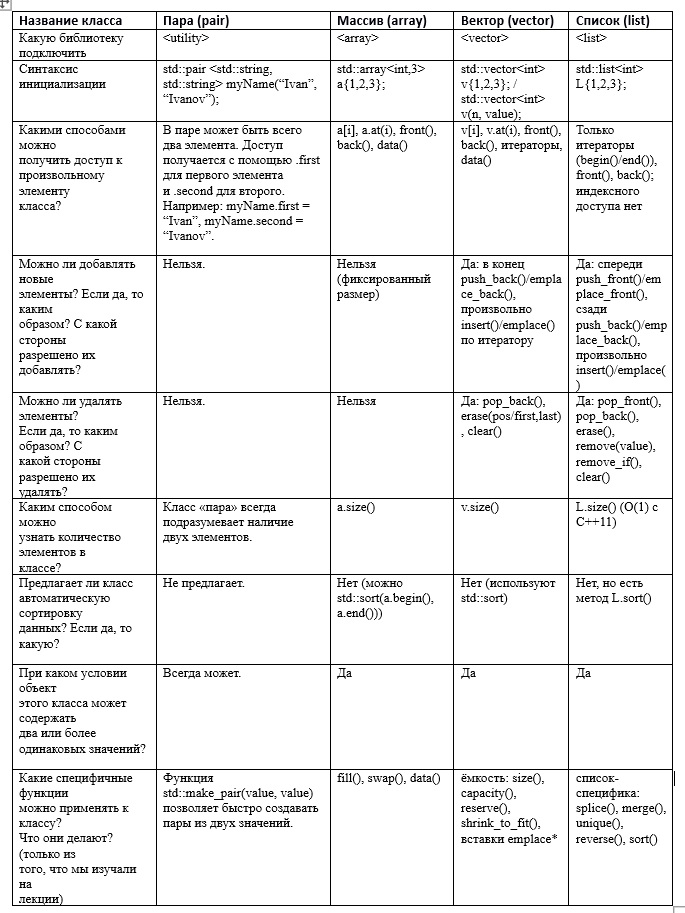
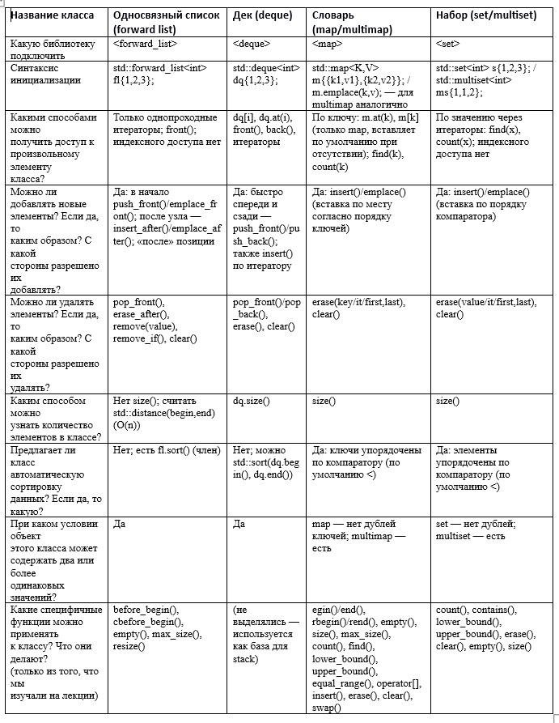
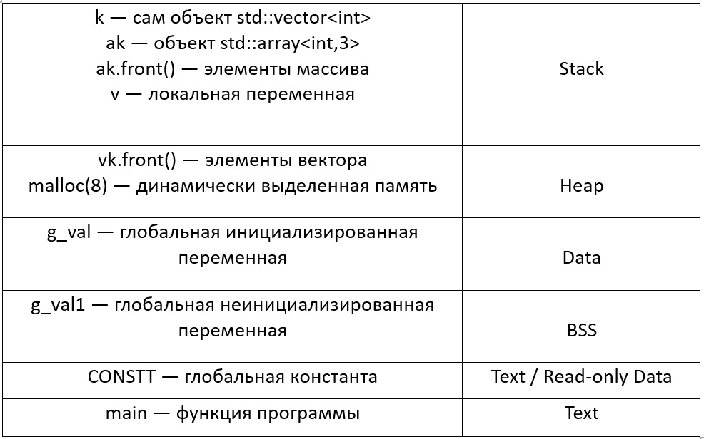

# **3 Тестовые задания**
## 1) ***Заполните таблицы 1 и 2, систематизирующие информацию о классах STL. Не стесняйтесь занимать место на страницах; убедитесь, что подробно прочитали вопросы в левом столбце. Информация о классе pair приведена в качестве образца.***
### Таблица №1

### Таблица №2

# ****************************************
## 2) ***Разместите адреса (заполните адресное пространство)(заполните следующую таблицу), для примера представленного ниже:***
### Таблица

# ****************************************
## 3) ***Найдите ошибки в коде, чтобы программа представленная ниже заработала, можно только добавлять что-то, но убирать нельзя.***
```cpp
class Dollars {
private:
int m_dollars;
public:
Dollars(int dollars) { m_dollars = dollars; }
// выполняем Dollars + Dollars через дружественную функцию
friend Dollars operator+(const Dollars &d1, const Dollars &d2);
// выполняем Dollars - Dollars через дружественную функцию
Dollars operator-(const Dollars &d1, const Dollars &d2);
Dollars operator*(const Dollars &d1, const Dollars &d2);
Dollars operator/(const Dollars &d1, const Dollars &d2);
int getDollars() const { return m_dollars; }
}
// Примечание: Эта функция не является методом класса!
Dollars +(const Dollars &d1, const Dollars &d2) {
// используем конструктор Dollars и operator+(int, int)
// мы имеем доступ к закрытому члену m_dollars, поскольку эта функция является дружественной классу Dollars
return Dollars(d1.m_dollars + d2.m_dollars);
}
// Примечание: Эта функция не является методом класса!
Dollars operator-(const Dollars &d1, const Dollars &d2) {
// используем конструктор Dollars и operator-(int, int)
// мы имеем доступ к закрытому члену m_dollars, поскольку эта функция является дружественной классу Dollars
return Dollars(d1.m_dollars - d2.m_dollars);
}
// Примечание: Эта функция не является методом класса!
Dollars operator*(const Dollars &d1, const Dollars &d2) {
// используем конструктор Dollars и operator*(int, int)
// мы имеем доступ к закрытому члену m_dollars, поскольку эта функция является дружественной классу Dollars
return Dollars(d1.m_dollars * d2.m_dollars);
}
// Примечание: Эта функция не является методом класса!
Dollars /(const Dollars &d1, const Dollars &d2) {
// используем конструктор Dollars и operator/(int, int)
// мы имеем доступ к закрытому члену m_dollars, поскольку эта функция является дружественной классу Dollars
return Dollars(d1.m_dollars / d2.m_dollars);
}
int main() {
Dollars dollars1();
Dollars dollars2();
std::cout << "+: " << (dollars1 + dollars2).getDollars() << " dollars." << std::endl;
std::cout << "-: " << (dollars1 - dollars2).getDollars() << " dollars." << std::endl;
std::cout << "*: " << (dollars1 * dollars2).getDollars() << " dollars." << std::endl;
std::cout << "/: " << (dollars1 / dollars2).getDollars() << " dollars." << std::endl;
std::cout << "/: " << (dollars1 + 3).getDollars() << " dollars." << std::endl;
}
```
## 3) ***Исправленный код*** 
```cpp
#include <iostream>

class Dollars {
private:
    int m_dollars;
public:
    Dollars(int dollars) { m_dollars = dollars; }
    // Выполняем Dollars + Dollars через дружественную функцию
    friend Dollars operator+(const Dollars &d1, const Dollars &d2);
    // Выполняем Dollars - Dollars через дружественную функцию

#if 0 // Выключаем неверные объявления операторов-членов с двумя параметрами
    Dollars operator-(const Dollars &d1, const Dollars &d2);
    Dollars operator*(const Dollars &d1, const Dollars &d2);
    Dollars operator/(const Dollars &d1, const Dollars &d2);
#endif

    int getDollars() const { return m_dollars; }

    // Правильные дружественные объявления для остальных операторов
    friend Dollars operator-(const Dollars &d1, const Dollars &d2);
    friend Dollars operator*(const Dollars &d1, const Dollars &d2);
    friend Dollars operator/(const Dollars &d1, const Dollars &d2);
}; // точка с запятой после класса

#if 0 // Выключаем опечатанную версию (было "Dollars +(")
Dollars +(const Dollars &d1, const Dollars &d2) {
    return Dollars(d1.m_dollars + d2.m_dollars);
}
#endif

// Правильная версия operator+
Dollars operator+(const Dollars &d1, const Dollars &d2) {
    return Dollars(d1.m_dollars + d2.m_dollars);
}

// Примечание: Эта функция не является методом класса!
Dollars operator-(const Dollars &d1, const Dollars &d2) {
    return Dollars(d1.m_dollars - d2.m_dollars);
}

// Примечание: Эта функция не является методом класса!
Dollars operator*(const Dollars &d1, const Dollars &d2) {
    return Dollars(d1.m_dollars * d2.m_dollars);
}

// Примечание: Эта функция не является методом класса!
#if 0 // Выключаем опечатанную версию (было "Dollars /(")
Dollars /(const Dollars &d1, const Dollars &d2) {
    return Dollars(d1.m_dollars / d2.m_dollars);
}
#endif

// Правильная версия operator/
Dollars operator/(const Dollars &d1, const Dollars &d2) {
    return Dollars(d1.m_dollars / d2.m_dollars);
}

// Смешанные перегрузки для выражения (dollars1 + 3)
inline Dollars operator+(const Dollars& d, int x) { return d + Dollars(x); }
inline Dollars operator+(int x, const Dollars& d) { return Dollars(x) + d; }

int main() {
    Dollars dollars1();
    Dollars dollars2();

    // Новый блок — создаём переменные с теми же именами и работаем с ними
    {
        Dollars dollars1{12};
        Dollars dollars2{3};

        std::cout << "+: " << (dollars1 + dollars2).getDollars() << " dollars." << std::endl;
        std::cout << "-: " << (dollars1 - dollars2).getDollars() << " dollars." << std::endl;
        std::cout << "*: " << (dollars1 * dollars2).getDollars() << " dollars." << std::endl;
        std::cout << "/: " << (dollars1 / dollars2).getDollars() << " dollars." << std::endl;
        std::cout << "/: " << (dollars1 + 3).getDollars() << " dollars." << std::endl;
    }

    return 0;
}
```
# ****************************************
## 4) ***Сделайте код программы рабочим, причем элементы массива выводим с использованием цикла foreach.***
```cpp
#include <iostream>
int sumArray(int array) {
int result = 0;
for (const auto &number : array)
result += number;
return result;
}
int main() {
int array[7] = { 10, 8, 6, 5, 4, 3, 1 };
std::cout << sumArray(array);
return 0;
}
```
## 4) ***Исправленный код*** 
```cpp
#include <iostream>

template <size_t N>
int sumArray(const int (&array)[N]) {
    int result = 0;
    for (const auto &number : array)
        result += number;
    return result;
}

int main() {
    int array[7] = {10, 8, 6, 5, 4, 3, 1};

    std::cout << "Элементы массива: ";
    for (const auto &number : array)
        std::cout << number << " ";

    std::cout << "\nСумма элементов: " << sumArray(array) << std::endl;
    return 0;
}
```
# ****************************************
## 4) **Найдите ошибки в коде, чтобы программа представленная ниже заработала, можно только добавлять что-то, но убирать нельзя.**
```cpp
void (*pfunc)();
void print(int i) {
std::cout << i << " ";
}
int main() {
int data[]{1,2,3,4,5};
int len = sizeof(data)/sizeof(data[0]);
std::for_each(data, data+len, pfunc);
return 0;
}
```
## 4) ***Исправленный код*** 
```cpp
#include <iostream>   
#include <algorithm>  

void (*pfunc)();

void print(int i) {
    std::cout << i << " ";
}

int main() {
    int data[]{1,2,3,4,5};
    int len = sizeof(data)/sizeof(data[0]);

    #define pfunc print   
    std::for_each(data, data+len, pfunc);
    #undef pfunc          

    return 0;
}
```
# ****************************************
## 5) ***Найдите ошибки в коде, чтобы программа представленная ниже заработала, можно только добавлять что-то, но убирать нельзя.***
```cpp
class Number {
private:
int m_number;
Number(int number=0): m_number(number) {}
Number& operator++();
Number& operator--();
Number operator++(int);
Number operator--(int);
friend std::ostream& operator<< (std::ostream &out, const Number &n);
}
Number ::operator++() {
++m_number;
return *this;
}
Number operator--(){
--m_number;
return *this;
}
Number Number::operator++(int){
Number temp(m_number);
++(*this);
return temp;
}
Number Number::operator--(int){
Number temp(m_number);
--(*this);
return temp;
}
std::ostream& operator<< (std::ostream &out, const Number &d){
out << d.m_number << "\n";
return out;
}
int main(){
Number number(6);
std::cout << ++number;
std::cout << number++;
std::cout << number;
std::cout << --number;
std::cout << number--;
std::cout << number;
}
```
## 5) ***Исправленный код*** 
```cpp
#include <iostream>

class Number {
private:
public: // делаем всё ниже публичным, ничего не удаляя
    int m_number;
    Number(int number = 0) : m_number(number) {}
    Number& operator++();
    Number& operator--();
    Number operator++(int);
    Number operator--(int);
    friend std::ostream& operator<< (std::ostream &out, const Number &n);
};

// Возвращаемый тип и квалификатор класса
Number& Number::operator++() {
    ++m_number;
    return *this;
}

Number& Number::operator--() {
    --m_number;
    return *this;
}

Number Number::operator++(int) {
    Number temp(m_number);
    ++(*this);
    return temp;
}

Number Number::operator--(int) {
    Number temp(m_number);
    --(*this);
    return temp;
}

std::ostream& operator<< (std::ostream &out, const Number &d) {
    out << d.m_number << '\n';
    return out;
}

int main() {
    Number number(6);
    std::cout << ++number;
    std::cout << number++;
    std::cout << number;
    std::cout << --number;
    std::cout << number--;
    std::cout << number;
}
```
# ****************************************
## 6) ***Найдите ошибки в коде, чтобы программа представленная ниже заработала, можно только добавлять что-то, но убирать нельзя.***
```cpp
int main() {
std::vector<int> numbers = { 1, 2, 3, 4, 5 };
for (int n : numbers)
std::cout << n << "\t";
std::cout << std::endl;
for (auto iter = begin(); iter != end(); iter++) {
std::cout << *iter << "\t";
}
}
```
## 6) ***Исправленный код*** 
```cpp
#include <iostream>     
#include <vector>       

int main() {
    std::vector<int> numbers = { 1, 2, 3, 4, 5 };

    for (int n : numbers)
        std::cout << n << '\t';
    std::cout << std::endl;
   
    for (auto iter = numbers.begin(); iter != numbers.end(); iter++) {
        std::cout << *iter << '\t';
    }
}
```
# ****************************************
## 7) ***Найдите ошибки в коде, чтобы программа представленная ниже заработала, можно только добавлять что-то, но убирать нельзя.***
```cpp
int main() {
std::list<int> li;
for (int nCount = 0; nCount < 5; ++nCount)
li.push_back(nCount);
std::list<int>::iter it;
it = min_element(li.begin(), li.end());
std::cout << "min: " << it << ' ';
it = max_element(li.begin(), li.end());
std::cout << "max: " << it << ' ';
}
```
## 7) ***Исправленный код*** 
```cpp
#include <iostream>   
#include <list>        
#include <algorithm>   

using std::min_element;   
using std::max_element;   

#define iter iterator     // Превратит std::list<int>::iter -> std::list<int>::iterator

// Вывод значения, на которое указывает итератор списка
std::ostream& operator<<(std::ostream& os, const std::list<int>::iterator& it) {
    return os << *it;
}

int main() {
    std::list<int> li;
    for (int nCount = 0; nCount < 5; ++nCount)
        li.push_back(nCount);
    std::list<int>::iter it;
    it = min_element(li.begin(), li.end());
    std::cout << "min: " << it << ' ';
    it = max_element(li.begin(), li.end());
    std::cout << "max: " << it << ' ';
    return 0; 
}
```
# ****************************************